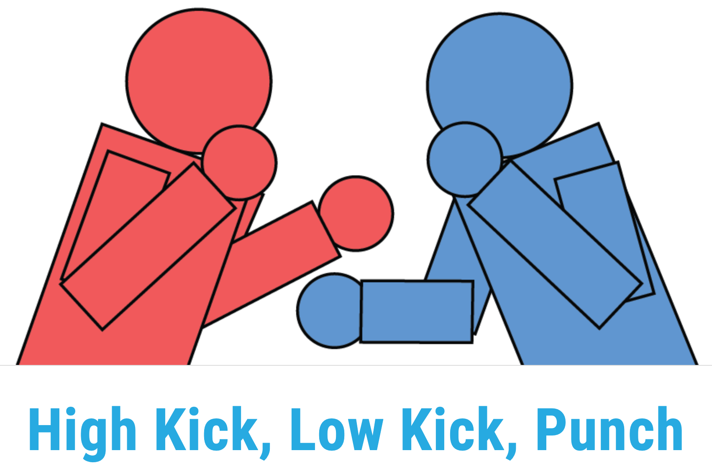
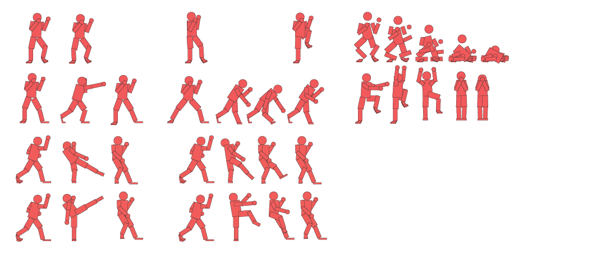
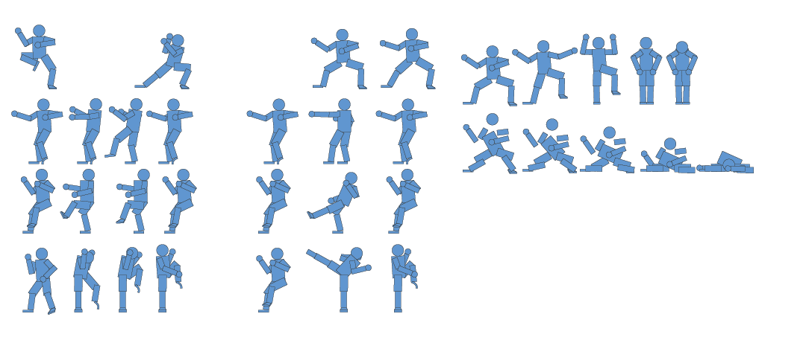

# About

High Kick, Low Kick, Punch (or Kick, Kick, Punch) is a spin off of traditional Rock Paper Scissors. It's played the same, but with the addition of being able to use combinations. One day I had the thought, "I wish I had a fun way to settle disputes with friends...", and within the next 48 hours High Kick, Low Kick, Punch was born.

This  was built many moons ago and could probably use quite a bit of code TLC :), but [you're welcome to try it out in real-time](http://jamie-k.com/side-projects/kick-kick-punch/)

# The Fighters

I chose Muay Thai Mark and Kung Fu Kirk as the playable characters. I didn't really dive into character development because they consist of animated gifs. Instead of controlling the actual motion of the characters you simply select your moves and they're executed. Going the GIF rout proved to be difficult because I not only had to make sure that all animations were the same length, but they all had to be within a certain bounding box to ensure that the fighters appeared to interact.

# The Guts

I decided that I didn't want to make just another rock paper scissors game so I added life bars, combos, stamina and dodging. This adds a little more competitiveness by allowing you to actually fight your opponent. Of course, it also introduced an enormous amount of complexity to the logic. It was difficult because I needed to make sure that the animations executed at the same time, stamina and life was tracked and that each player was able to enter combinations. I also added the ability to play against a computer opponent.

After countless hours of writing pseudocode, running through logic and wearing out the keys on my keyboard the high kick, low kick, punch engine was complete.

## License
[MIT](https://choosealicense.com/licenses/mit/)
